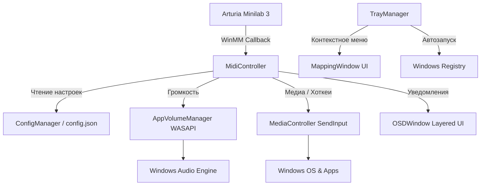

<div align="center">

# 🎛 MidiControl — Управление Windows через Arturia Minilab 3

**Легковесное и высокопроизводительное C++17 приложение для Windows (MSVC), превращающее MIDI-клавиатуру Arturia Minilab 3 в многофункциональный пульт управления звуком, медиаплеером, макросами и системными хоткеями.**

[](https://github.com/Vane4ka2k2/MidiControl/releases/latest)
[](https://github.com/Vane4ka2k2/MidiControl/actions)


[** Скачать последнюю версию (.zip)**](https://github.com/Vane4ka2k2/MidiControl/releases/latest) • [** Справка по настройке**](docs/CONFIGURATION.md) • [** Архитектура**](docs/ARCHITECTURE.md)

</div>

---

## 📑 Оглавление
- [🌟 Основные возможности](#-основные-возможности)
- [📦 Быстрый старт и скачивание](#-быстрый-старт-и-скачивание)
- [🎛 Карта элементов по умолчанию](#-карта-элементов-по-умолчанию)
- [🔄 Схема работы приложения](#-схема-работы-приложения)
- [🛡 Первый запуск и Windows SmartScreen](#-первый-запуск-и-windows-smartscreen)
- [📚 Документация](#-документация)
- [🛠 Сборка из исходников](#-сборка-из-исходников)
- [📁 Структура проекта](#-структура-проекта)
- [📜 Лицензия](#-лицензия)

---

## 🌟 Основные возможности

- 🎛 **Управление громкостью (Master & Focus)** — Регулировка общей мастер-громкости Windows на 1-м фейдере и громкости активного фокусного окна на 1-м энкодере через **WASAPI Core Audio API**.
- ⏩ **Перемотка и Масштабирование** — Плавная перемотка медиафайлов/треков и изменение масштаба страниц в браузерах с помощью энкодеров (Encoders 1–2).
- 🚀 **Быстрые макросы и системные действия** — Мгновенный показ рабочего стола (`Win+D`), запуск Telegram, скриншот области (`Win+Shift+S`) и приглушение звука (Smart Ducking 10%).
- 🖥 **Полупрозрачный OSD Overlay** — Стильный индикатор поверх всех окон с анимацией таймера, отображающий уровень громкости и статус выполненных действий.
- ⚙️ **Системный трей и Автозапуск** — Фоновая работа возле часов, контекстное меню управления и интеграция с реестром Windows для автозагрузки.
- 🗺 **Графическая карта-шпаргалка (`MappingWindow`)** — Встроенное окно с визуальной схемой назначения клавиш в тёмном дизайне.

---

## 📦 Быстрый старт и скачивание

1. Перейдите в раздел **[Releases](https://github.com/Vane4ka2k2/MidiControl/releases/latest)** и скачайте `MidiControl-vX.Y.Z-win64.zip`.
2. Распакуйте архив в удобную папку (например, `C:\Tools\MidiControl`).
3. Подключите вашу MIDI-клавиатуру **Arturia Minilab 3** по USB.
4. Запустите `MidiControl.exe`. Приложение автоматически найдёт клавиатуру и свернётся в трей.

---

## 🎛 Карта элементов по умолчанию

### 🎚 Фейдеры (Faders)
| Элемент | MIDI CC | Действие (`type`) | Описание |
| :--- | :--- | :--- | :--- |
| **Fader 1** | `82` (Arturia) / `14` (DAW) | `master_volume` | Общая мастер-громкость Windows |
| **Faders 2–4** | `83`, `85`, `15` | — | Свободны для пользовательской настройки |

### 🎛 Энкодеры (Encoders)
| Элемент | MIDI CC | Действие (`action`) | Описание |
| :--- | :--- | :--- | :--- |
| **Encoder 1** | `74` | `seek_media` | Перемотка видео / трека (Вперед при `CC > 64`, Назад при `CC < 64`) |
| **Encoder 2** | `71` | `zoom_browser` | Масштабирование сайтов (`Ctrl+Plus` при `CC > 64`, `Ctrl+Minus` при `CC < 64`) |

### 🎹 Пэды (Pads 1–8)
| Пэд | Note / CC | Действие (`action`) | Сочетание / Описание |
| :--- | :--- | :--- | :--- |
| **Pad 1** | Note `36` / CC `102` | `master_mute` | Включить / Выключить звук Windows (`VK_VOLUME_MUTE`) |
| **Pad 2** | Note `37` / CC `103` | `smart_ducking` | Временное приглушение звука до 10% |
| **Pad 3** | Note `38` / CC `104` | `media_prev` | Предыдущий трек (`VK_MEDIA_PREV_TRACK`) |
| **Pad 4** | Note `39` / CC `105` | `media_play_pause` | Воспроизведение / Пауза (`VK_MEDIA_PLAY_PAUSE`) |
| **Pad 5** | Note `40` / CC `106` | `media_next` | Следующий трек (`VK_MEDIA_NEXT_TRACK`) |
| **Pad 6** | Note `41` / CC `107` | `launch_telegram` | Быстрый запуск Telegram по протоколу `tg://` |
| **Pad 7** | Note `42` / CC `108` | `show_desktop` | Свернуть все окна / Показать рабочий стол (`Win + D`) |
| **Pad 8** | Note `43` / CC `109` | `snipping_tool` | Захват области экрана Ножницами (`Win + Shift + S`) |

---

## 🔄 Схема работы приложения



---

## 🛡 Первый запуск и Windows SmartScreen

При первом запуске файла `MidiControl.exe` фильтр **Microsoft Defender SmartScreen** в Windows может показать синее окно предупреждения: *«Система Windows защитила ваш компьютер»*.

> [!NOTE]
> Это стандартное поведение Windows для любых новых утилит и Open-Source проектов, у которых нет платной коммерческой цифровой подписи (Code Signing Certificate).
> **Приложение абсолютно безопасно, не требует установки и не содержит вредоносного кода.**

### Как разрешить запуск:
1. В синем окне SmartScreen нажмите ссылку **«Подробнее»** (*More info*).
2. В появившемся меню нажмите кнопку **«Выполнить в любом случае»** (*Run anyway*).
3. Приложение запустится и свернётся в системный трей возле часов.

---

## 📚 Документация

- ⚙️ **[Руководство по конфигурации (CONFIGURATION.md)](docs/CONFIGURATION.md)** — Справочник всех параметров `config.json`, привязка MIDI CC/Note и настраиваемые команды.
- 🏗 **[Архитектура приложения (ARCHITECTURE.md)](docs/ARCHITECTURE.md)** — Подробное техническое описание устройства WASAPI, WinMM, GDI Overlay и многопоточности.

---

## 🛠 Сборка из исходников

### Требования:
- Компилятор MSVC (Visual Studio 2019 / 2022 / 2026)
- CMake 3.16+

### 1-клик сборка через BAT-скрипт:
```cmd
.\build.bat
```
Исполняемый файл будет собран по пути: `build\Release\MidiControl.exe`.

---

## 📁 Структура проекта

```
.
├── .github/workflows/
│   └── release.yml             # CI/CD автоматический релиз при push тега
├── CMakeLists.txt              # Скрипт сборки CMake
├── config.json                 # Пользовательский файл конфигурации
├── Doxyfile                    # Конфигурация Doxygen
├── build.bat                   # Скрипт сборки в 1 клик для MSVC
├── docs/
│   ├── ARCHITECTURE.md         # Описание архитектуры и подсистем
│   └── CONFIGURATION.md        # Справочник конфигурации
├── include/
│   ├── Utils.h                 # Утилиты кодировок UTF-8/UTF-16
│   ├── ConfigManager.h         # Парсер и структура конфигурации JSON
│   ├── AppVolumeManager.h      # Управление громкостью WASAPI
│   ├── MediaController.h       # Эмуляция мультимедиа и хоткеев
│   ├── OSDWindow.h            # Полупрозрачный OSD-индикатор
│   ├── MappingWindow.h       # Окно интерактивной шпаргалки
│   ├── TrayManager.h         # Системный трей Windows
│   └── MidiController.h      # Диспетчер событий MIDI
└── src/
    ├── Utils.cpp
    ├── ConfigManager.cpp
    ├── AppVolumeManager.cpp
    ├── MediaController.cpp
    ├── OSDWindow.cpp
    ├── MappingWindow.cpp
    ├── TrayManager.cpp
    ├── MidiController.cpp
    └── main.cpp              # Точка входа приложения
```

---

## 📜 Лицензия

Распространяется под лицензией **[MIT](LICENSE)**. Вы можете свободно использовать, изменять и распространять данное программное обеспечение.
