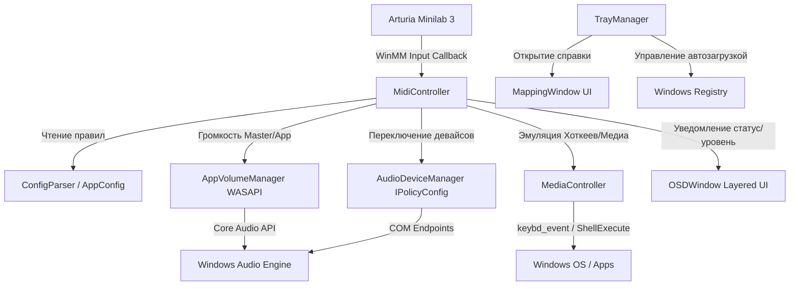

# Архитектура проекта MidiControl 🏗

**MidiControl** — это высокопроизводительное системное C++ приложение для Windows, предназначенное для интеграции MIDI-контроллера (Arturia Minilab 3) с подсистемами ввода и вывода звука, интерфейсом ОС Windows и фоновым управлением процессами.

---

## 📐 Архитектурный обзор

Приложение устроено по модульному принципу. Все основные подсистемы изолированы в логических классах и взаимодействуют через статическое либо синглтон-управление.



---

## 🎛 Модули и Подсистемы

### 1. Подсистема MIDI (`MidiController`)
- **API**: Windows Multimedia API (`winmm.lib`).
- **Отвечает за**:
  - Автоматическое перечисление входных MIDI-портов (`midiInGetNumDevs`, `midiInGetDevCapsW`).
  - Поиск подключённой клавиатуры Arturia (по подстроке `"Minilab"` в имени порта).
  - Запуск асинхронного драйверного коллбэка `MidiInProc` (`MIM_DATA`).
  - Расшифровку байтов MIDI-сообщений:
    - `0xB0` (Control Change / CC) — поворот энкодеров и смещение фейдеров.
    - `0x90` / `0x80` (Note On / Note Off) — нажатие и отпускание пэдов.
  - Поддержку откликов энкодеров с относительным шагом (Relative mode) и абсолютным (Absolute mode).

### 2. Подсистема WASAPI и Audio Endpoints (`AppVolumeManager`, `AudioDeviceManager`)
- **API**: Core Audio API, COM, `mmdeviceapi.h`, `endpointvolume.h`, `audiopolicy.h`.
- **`AppVolumeManager`**:
  - Управление общим уровнем мастер-громкости Windows через интерфейс `IAudioEndpointVolume` (значения в диапазоне `0.0f` – `1.0f`).
  - Сканирование активных аудиосессий приложений через `IAudioSessionEnumerator`.
  - Изменение громкости конкретных процессов (по их `.exe` имени) через `ISimpleAudioVolume`.
- **`AudioDeviceManager`**:
  - Получение списка всех активных устройств воспроизведения (Наушники, Динамики, Внешний ЦАП).
  - Переключение звукового выхода по умолчанию на лету с помощью системного COM-интерфейса `IPolicyConfig` (`SetDefaultEndpoint`).

### 3. Графический интерфейс и OSD (`OSDWindow`, `MappingWindow`, `TrayManager`)
- **API**: Win32 API, GDI (`wingdi.h`), Shell API (`shellapi.h`).
- **`OSDWindow`**:
  - Создание полупрозрачного всплывающего окна над панелью задач (`WS_EX_LAYERED | WS_EX_TOPMOST | WS_EX_TRANSPARENT`).
  - Отрисовка плашки громкости и статуса устройства с помощью кастомных шрифтов и двухцветных прогресс-баров.
  - Анимированное плавное скрытие по настраиваемому таймеру (`osd_duration_ms`).
- **`MappingWindow`**:
  - Окно-шпаргалка с полной интерактивной картой назначения органов управления Arturia Minilab 3.
  - Поддержка темного оформления (Dark Theme) и автоцентрирования при открытии.
- **`TrayManager`**:
  - Размещение иконки приложения в системном трее возле часов (`Shell_NotifyIconW`).
  - Контекстное меню с функциями: Вызов карты клавиш, Переключение отладочной консоли, Автозагрузка Windows, Выход.

### 4. Подсистема эмуляции макросов (`MediaController`)
- **API**: Win32 `keybd_event`, `ShellExecuteW`.
- **Поддерживаемые команды**:
  - Управление медиаплеером (`VK_MEDIA_PLAY_PAUSE`, `VK_MEDIA_NEXT_TRACK`, `VK_MEDIA_PREV_TRACK`, `VK_VOLUME_MUTE`).
  - Горчие клавиши Windows (`Win + D` — Показать рабочий стол, `Win + Shift + S` — Захват экрана Snipping Tool).
  - Навигация и Zoom (`Стрелка Влево / Вправо` для перемотки видео, `Ctrl + Plus / Minus` для масштабирования сайтов).
  - Быстрый запуск мессенджера Telegram по зарегистрированному URI-протоколу `tg://`.

### 5. Менеджер конфигурации (`ConfigParser`)
- **API**: C++ Standard Library (`<fstream>`, `<map>`, `<vector>`).
- **Назначение**:
  - Парсинг структуры `config.json`.
  - Загрузка маппингов фейдеров, энкодеров и пэдов.
  - Резервный фолбэк на конфигурацию по умолчанию в случае отсутствия или повреждения `config.json`.

---

## 🔄 Поток выполнения и поток сообщений Win32

```
[WinMain / main.cpp]
        │
        ├── 1. SetConsoleOutputCP(CP_UTF8)
        ├── 2. OSDWindow::Initialize()
        ├── 3. MappingWindow::Initialize()
        ├── 4. TrayManager::Initialize()
        ├── 5. MidiController::Initialize("config.json") -> Start()
        │
        └── 6. Главный цикл Win32 (GetMessageW -> DispatchMessageW)
                    │
                    ├── Приход MIDI-события (WinMM Callback Thread)
                    │        └── Dispatch -> OSDWindow::Show() + Audio/Key Simulation
                    │
                    └── Сообщения от системного трея / Окон (GUI Thread)
                             └── Контекстное меню / Отрисовка MappingWindow
```

---

## 🧵 Потоковая модель и потокобезопасность

1. **Главный поток (GUI Thread)**: Выполняет инициализацию Win32 окон (`OSDWindow`, `MappingWindow`, `TrayManager`) и крутит главный цикл обработки сообщений (`GetMessageW`).
2. **Драйверный поток MIDI (WinMM Callback Thread)**: Прерывание Windows Multimedia вызывает `MidiInProc` в отдельном системном потоке при каждом повороте ручки или нажатии пэда.
3. **COM / WASAPI**: Каждый модуль самостоятельно управляет вызовами `CoInitialize` / `CoUninitialize` для использования COM-компонентов Аудио в Apartment Threading.
